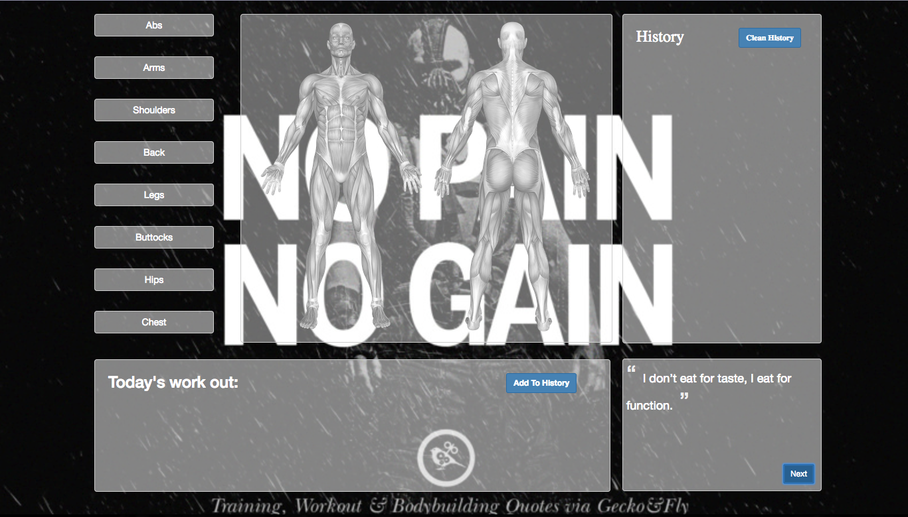
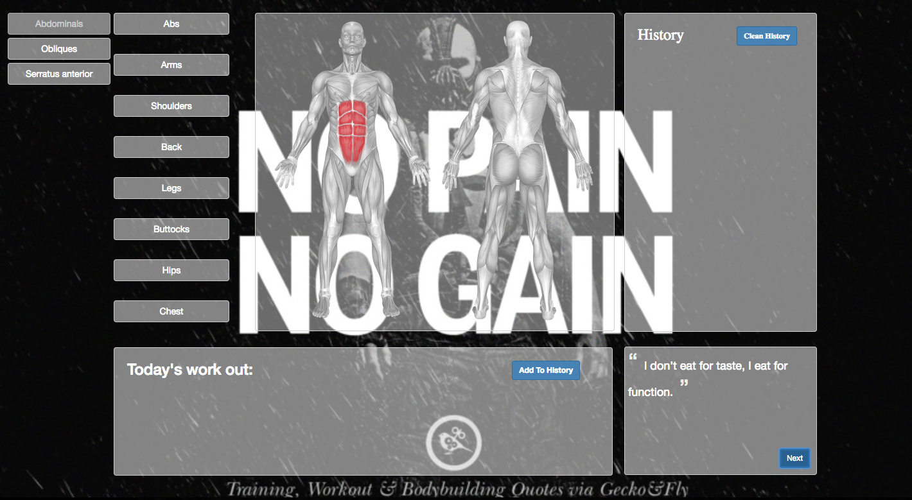
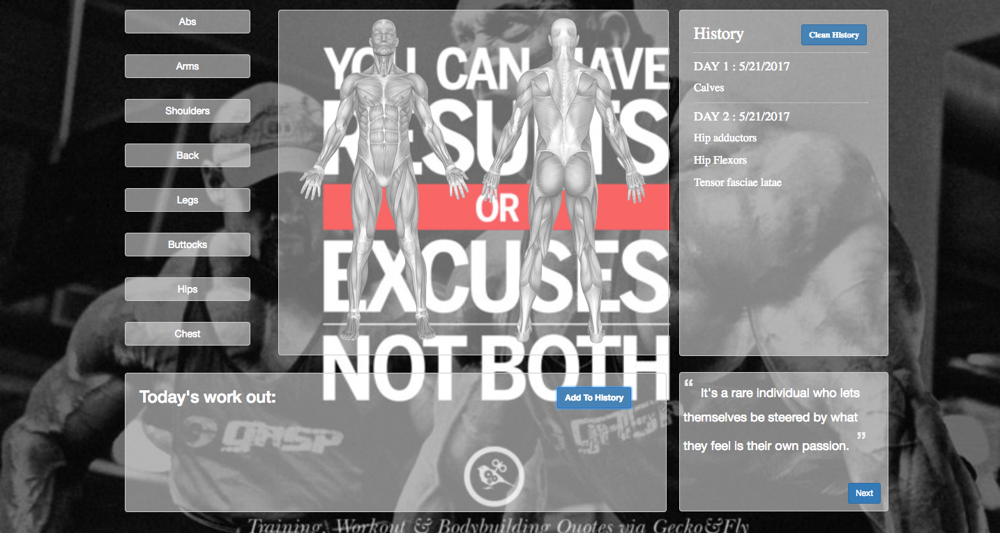
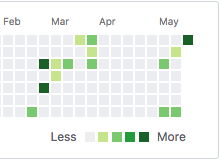

# 说明

这是一款专为健身爱好者设计，用来记录每日健身计划的轻量级WEB应用，目前已实现大部分功能。

## Highlight Muscle
当鼠标悬停在左侧的肌肉名称上面时，中间的相应部位就会有一个高亮效果：

## Today's work out
当点击左侧肌肉列表上的部位时，该部位就会添加到左下角的Today's work out，你可以将今日健身所锻炼到的部位一一添加到这一栏当中：

## Add To History && Clean History
当你确认好Today's work out的内容之后，便可将这一栏中的内容添加到右侧的History栏当中。

History 中记录的是当前是健身的第几天，以及今当天的日期，最关键的是当天锻炼的部位。

添加到History当中的数据是不会被清除的，除非主动清除浏览器数据或者是点击Clean History按钮，不然不管你怎么刷新或者是关闭页面重新开启，History当中的数据都还是会在你重新打开页面的时候再次出现。

## Random Quotes
右下角是一个Random Quotes，随机出现一句鸡汤味十足的健身励志语录，点击Next按钮将随机切换下一句。

## History Highlight
这是一个还没实现的功能，该功能实现之后，当鼠标悬停在History这一栏时，所有的锻炼过的部位都会高亮，并且你曾经练得越多的部位将显示越深的颜色，以此来直观的展示锻炼效果。

该功能的灵感来源于Github：

目前暂时没有好的实现方法。

